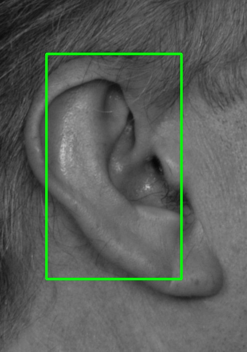
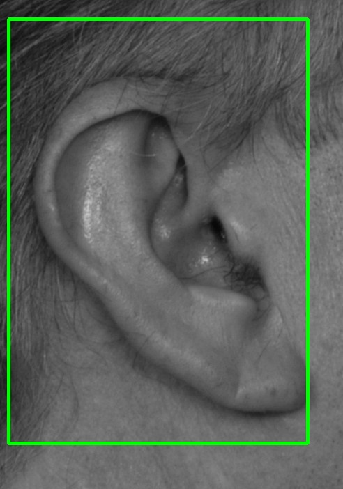
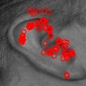
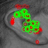
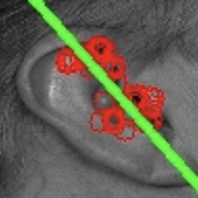
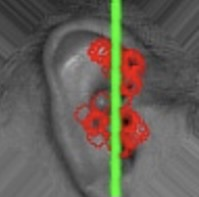

# Ear-Recognizer-Android
Ear recognition system leveraging Android camera and OpenCV for online verification and identification of enrolled subjects.

## Recognition pipeline
<table>
  <tr style align="center"><td>(1)</td><td>(2)</td><td>(3)</td><td>(4)</td><td>(5)</td><td>(6)</td></tr>
  <tr align="center">
    <td></td>
    <td></td>
    <td></td>
    <td></td>
    <td></td>
    <td></td>
  </tr>
</table>

1. Detect the ear shape and extract the ROI
2. Increase detected ROI with symmetric padding
3. Extract ear landmarks
4. Remove outliers
5. Estimate the ear orientation
6. Align the image according to the correct angle and apply the zoom trick
7. Extract image descriptors and compute similarity scores with gallery templates

## Datasets
- [AMI Ear Database](https://ctim.ulpgc.es/research_works/ami_ear_database/)

## External resources

For the ear detection task, we leverage the Haar feature-based cascade classifiers provided by IUSIANI. You may find them publicly available [here](https://github.com/DiUS/Physiognomy/tree/master/python/haarcascades) or [here](https://github.com/opencv/opencv/blob/e33bfb5ebfcf51b5f15995c08fd68a6b2ecb2f1e/data/haarcascades).
