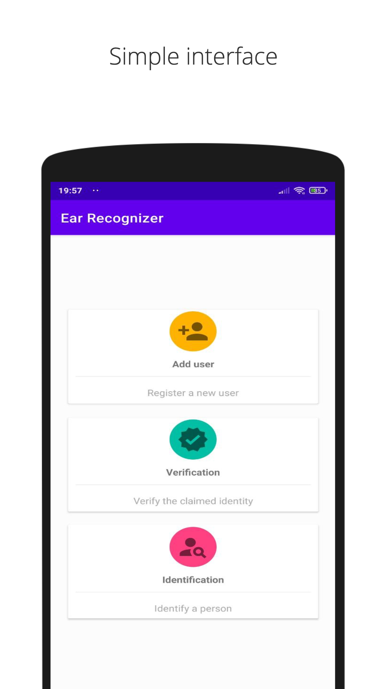
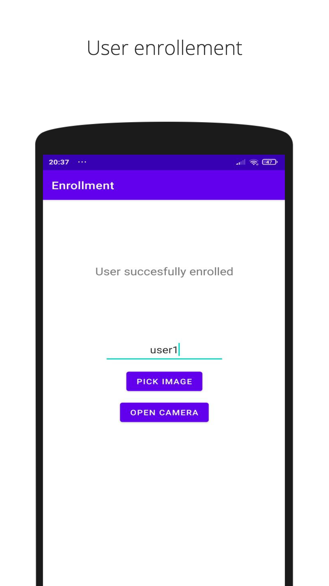
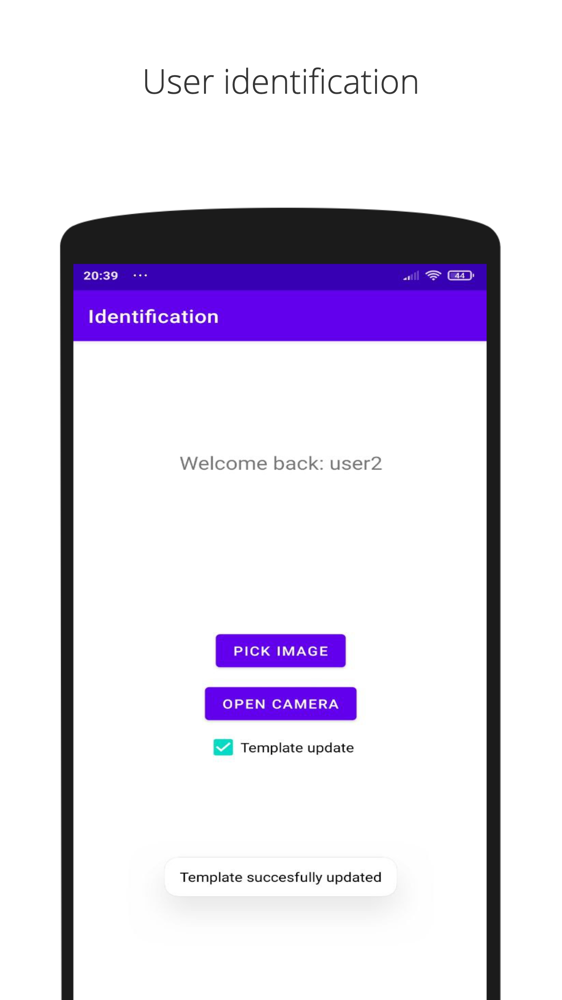
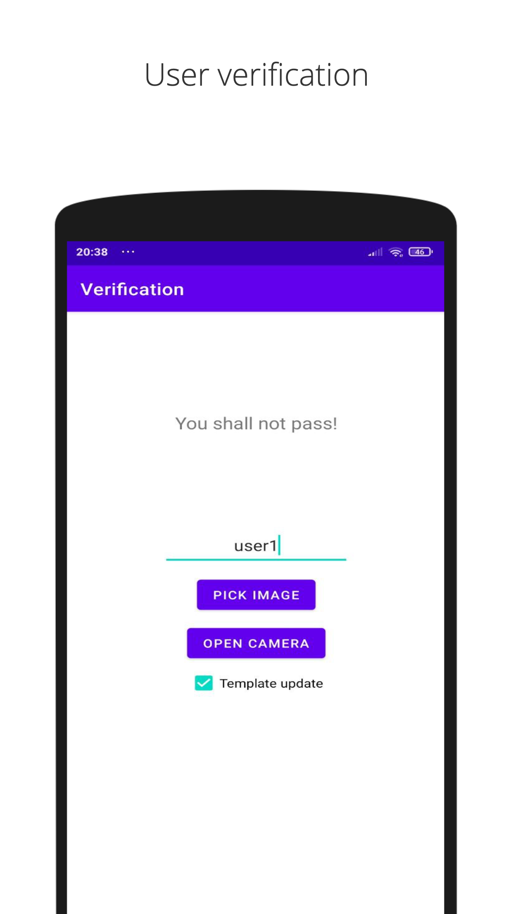

# Ear Recognizer
A simple Android application for online verification and identification of enrolled subjects.

## How to use
Install the app on your device using the APK file that you may find in the release files.

## Preview

## App icon credit
Icons made by <a href="https://www.freepik.com" title="Freepik">Freepik</a> from <a href="https://www.flaticon.com/" title="Flaticon">www.flaticon.com</a>
